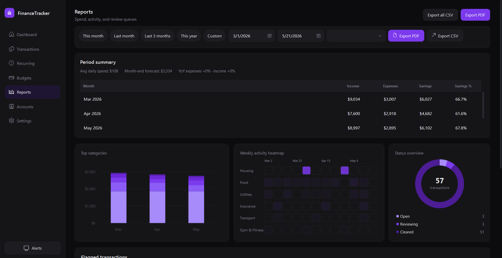

# FinanceTracker

A polished, dark-themed **personal finance desktop app** built with WPF (.NET 8) and SQLite. Track transactions, budgets, recurring rules, accounts, and generate detailed financial reports — all locally, no cloud required.

---



---

## Features

### Dashboard
- Animated KPI cards: Net Worth, Monthly Income, Monthly Expenses, Savings Rate
- Live donut chart for spending breakdown by category
- Monthly cash-flow bar chart (income vs. expenses vs. savings)
- Recent transactions list with category icons and color-coded amounts
- Month-over-month change indicators (↑ ↓)

### Transactions
- Full transaction list with search, category filter, date filter, and type filter
- Add / Edit / Delete transactions with an animated modal dialog
- Mark transactions as recurring directly from the list
- Inline budget progress bar per category row
- **Ctrl+N** to open the Add Transaction dialog from anywhere
- **Ctrl+E** to export the current filtered view to CSV

### Recurring Rules
- Create recurring income or expense rules (Daily / Weekly / Monthly / Yearly)
- Pause / resume individual rules
- Automatic transaction generation on app startup for all due rules
- Toast notification + notification center entry when recurring transactions fire

###  Budgets
- Monthly budget limits per spending category
- Visual progress bars with colour-coded risk levels (safe / warning / over-budget)
- Budget alert notifications when 80 % or 100 % of a limit is hit
- Month navigator to review historical budget performance

### Reports
- **Top Categories** horizontal bar chart (single-month) or stacked monthly chart (multi-month)
- **12-week activity heatmap** by category — always shows the last 12 weeks regardless of the date filter
- Transaction status gauge (Open / Reviewing / Cleared)
- Month summary table: Income, Expenses, Savings, Savings %
- Average daily spend, month-end forecast, and year-over-year comparison
- **Flagged transactions** list (large or recurring expenses) with status badges
- Export full report to **PDF** (QuestPDF) or **CSV**
- Account filter and preset date ranges: This Month / Last Month / Last 3 Months / This Year

###  Accounts
- Account cards with current balance, account type badge, and accent colour
- Sparkline mini-chart per account showing 30-day balance trend
- Recent activity list per account
- Add / Edit / Delete accounts (Checking, Savings, Credit Card, Investment, Cash)
- Multi-currency support (USD, EUR, GBP, CAD, AUD, JPY, CHF) with live conversion to base currency

###  Settings
- **Appearance**: accent colour picker, font size, dark mode toggle
- **Regional**: currency, date format, first day of week
- **Data**: CSV import preview, backup database, restore database
- **Danger zone**: clear all transactions, reset to defaults
- Changes apply live without requiring a restart

---

## Tech Stack

| Layer | Technology |
|---|---|
| **UI Framework** | WPF (.NET 8, Windows only) |
| **Architecture** | MVVM via `CommunityToolkit.Mvvm` |
| **Database** | SQLite via Entity Framework Core 8 |
| **Charts** | LiveCharts2 (`LiveChartsCore.SkiaSharpView.WPF`) |
| **PDF Export** | QuestPDF |
| **DI Container** | `Microsoft.Extensions.DependencyInjection` |
| **Language** | C# 12 |

---

##  Getting Started

### Requirements
- Windows 10 / 11
- [.NET 8 SDK](https://dotnet.microsoft.com/download/dotnet/8.0)

### Run

```powershell
git clone https://github.com/erdilatifi/Expense-Tracker-Desktop-.NET.git
cd Expense-Tracker-Desktop-.NET\FinanceTracker
dotnet run
```

The app creates its SQLite database at `%LOCALAPPDATA%\FinanceTracker\finance.db` and seeds it with **realistic demo data** on first launch (5 accounts, 16 categories, ~220 transactions over 6 months, 7 recurring rules, 72 budget records).

### Build Release

```powershell
dotnet publish FinanceTracker\FinanceTracker.csproj -c Release -r win-x64 --self-contained
```

---

##  Keyboard Shortcuts

| Shortcut | Action |
|---|---|
| `Ctrl + N` | New transaction |
| `Ctrl + E` | Export current view to CSV |
| `Ctrl + 1` | Go to Dashboard |
| `Ctrl + 2` | Go to Transactions |
| `Ctrl + 3` | Go to Recurring |
| `Ctrl + 4` | Go to Budgets |
| `Ctrl + 5` | Go to Reports |
| `Ctrl + 6` | Go to Accounts |
| `Ctrl + 7` | Go to Settings |
| `Esc` | Close open overlay / dialog |

---

##  Project Structure

```
FinanceTracker/
├── Data/
│   ├── FinanceDbContext.cs       # EF Core DbContext, migrations, balance recalc
│   └── Migrations/               # EF Core migration files
├── Models/
│   ├── Transaction.cs
│   ├── Account.cs
│   ├── Category.cs
│   ├── Budget.cs
│   └── RecurringRule.cs
├── Services/
│   ├── DatabaseService.cs        # Seeding + initialization
│   ├── RecurringService.cs       # Fires due recurring rules on startup
│   ├── BudgetAlertService.cs     # Budget threshold notifications
│   ├── AppSettingsService.cs     # Persists user preferences
│   ├── NotificationService.cs    # In-app toast + notification center
│   ├── ReportService.cs          # Cash-flow, category spend, heatmap queries
│   └── ErrorDialogService.cs     # Custom dark error dialog
├── ViewModels/
│   ├── DashboardViewModel.cs
│   ├── TransactionsViewModel.cs
│   ├── RecurringViewModel.cs
│   ├── BudgetsViewModel.cs
│   ├── ReportsViewModel.cs
│   ├── AccountsViewModel.cs
│   ├── SettingsViewModel.cs
│   └── MainViewModel.cs
├── Views/
│   ├── DashboardView.xaml
│   ├── TransactionsView.xaml
│   ├── BudgetsView.xaml
│   ├── ReportsView.xaml
│   ├── AccountsView.xaml
│   ├── SettingsView.xaml
│   └── Dialogs/
│       └── AddTransactionDialog.xaml
├── Themes/
│   ├── DarkTheme.xaml            # Global colour tokens and base styles
│   └── ModernControls.xaml       # Custom control templates
├── Converters/                   # Value converters for XAML bindings
├── App.xaml / App.xaml.cs        # DI setup, startup, accent colour apply
└── MainWindow.xaml               # Navigation shell, page transitions, shortcuts
```

---

##  License

MIT — free to use, modify, and distribute.
